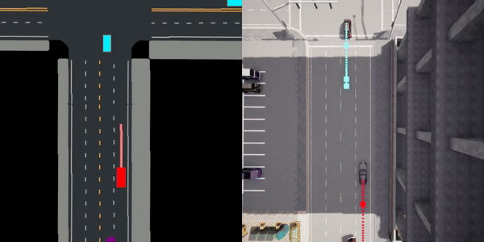
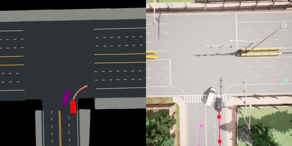
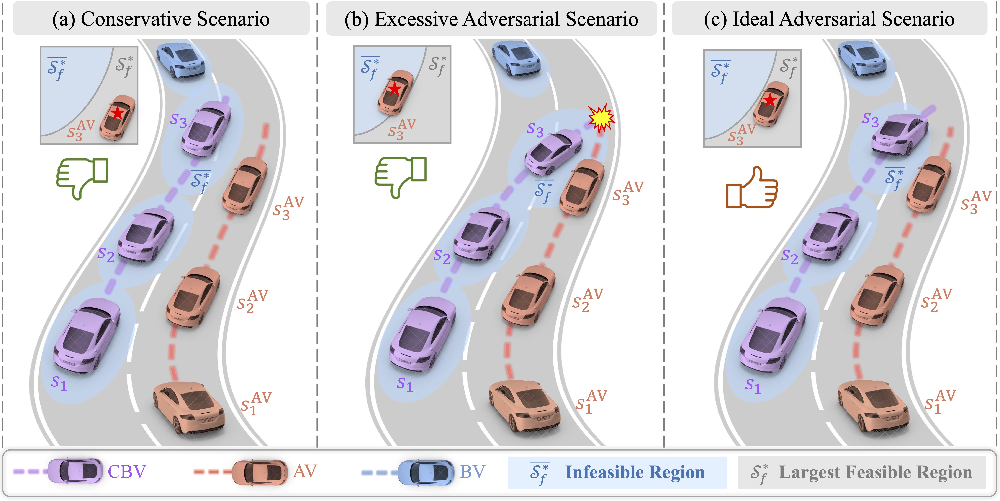

# FREA: Feasibility-Guided Generation of Safety-Critical Scenarios with Reasonable Adversariality

<div align="center">
    <a href="https://arxiv.org/abs/2406.02983"></a>     
    <a href="https://currychen77.github.io/FREA/"></a>     
    <a href="https://github.com/CurryChen77/FREA/stargazers"></a>
</div>        

<table style="border-collapse: collapse; width: 100%; table-layout: fixed;">
  <tr>
    <td style="border: 0; padding: 0; width: 50%;">
      
    </td>
    <td style="border: 0; padding: 0; width: 50%;">
      
    </td>
  </tr>
</table>
## :sparkles: News

- **`2024-09-05`** Exciting news! **FREA is accepted by CoRL 2024 🎉🎉!** 
- **`2024-08-10`** Explore our project page, now live [here](https://currychen77.github.io/FREA/)🔗!
- **`2024-08-10`** Codes are now release!
- **`2024-06-05`** Our paper is available on [Arxiv](https://arxiv.org/abs/2406.02983)📄!

This repository contains the implementation of the paper.

> FREA: Feasibility-Guided Generation of Safety-Critical Scenarios with Reasonable Adversariality<br>
>
> [Keyu Chen](https://currychen77.github.io/)<sup>1</sup> , [Yuheng Lei](https://sites.google.com/view/yuhenglei)<sup>2</sup>, [Hao Cheng](https://orcid.org/0009-0009-9401-2937)<sup>1</sup>, [Haoran Wu](https://scholar.google.com/citations?user=5hmsPUYAAAAJ&hl=zh-CN&oi=ao)<sup>1</sup>, [Wenchao Sun](https://scholar.google.com/citations?user=yd-sMoQAAAAJ&hl=zh-CN&oi=ao)<sup>1</sup>, [Sifa Zheng](http://www.svm.tsinghua.edu.cn/essay/80/1835.html)<sup>1</sup><br>
>
> <sup>1</sup>School of Vehicle and Mobility, Tsinghua University <sup>2</sup>The University of Hong Kong<br>

If you find our work useful, Please give us a star 🌟!

:dizzy: *FREA incorporates feasibility as guidance to generate adversarial yet AV-feasible, safety-critical scenarios.*

<div style="text-align: center;">    </div>

## :page_with_curl: Outline
  -  :wrench: [Setup](#wrench-Setup)
  - :books: [Usage](#books-Usage)
    - :open_file_folder: [1. Collect Offline Data](#open_file_folder-Collect-Offline-Data)
    - :fire: [2. Train optimal feasible value function of AV](#fire-Train-optimal-feasible-value-function-of-AV)
    - :fire: [3. Train adversarial policy of CBV](#fire-Train-adversarial-policy-of-CBV)
    - :fire: [4. Train AV (optional)](#fire-Train-AV-optional)
    - :snowflake: [5. Evaluation](#snowflake-Evaluation)
    - :chart_with_upwards_trend: [6. Results Analysis](#chart_with_upwards_trend-Results-Analysis)
    - :clapper: [7. Visualization](#clapper-Visualization)
  - :bookmark: [Citation](#bookmark-citation)
  - :clipboard: [Acknowledgement](#clipboard-Acknowledgement)

## :wrench: Setup

**Recommended system: Ubuntu 20.04 or 22.04**

Step 1: Install [Carla](https://carla.readthedocs.io/en/latest/start_quickstart/) (0.9.13 recommended)

Step 2: Setup conda environment

```bash
conda create -n frea python=3.8
conda activate frea
```

Step 3: Clone this git repo in an appropriate folder

```bash
git clone git@github.com:CurryChen77/FREA.git
```

Step 4: Enter the repo root folder and install the packages:

```bash
cd FREA
pip install -r requirements.txt
pip install -e .
```

##  :books: Usage

### :open_file_folder: Collect Offline Data

#### Collect data from specific AV and CBV

```bash
# Launch CARLA
./CarlaUE4.sh -prefernvidia -RenderOffScreen -carla-port=2000

# Launch in another terminal
python scripts/run.py --agent_cfg expert.yaml --scenario_cfg standard_train.yaml --mode collect_feasibility_data
```

#### Merge all data from different AV and CBV

```bash
# Merge data
python frea/feasibility/unify_offline_data.py
```

To use the offline dataset in our paper download from [here](https://cloud.tsinghua.edu.cn/d/2a294f680b7844cb8248/) put them into the `feasibility` folder.

### :fire: Train optimal feasible value function of AV

```bash
# Train optimal feasible value function of AV
python train_feasibility.py
```

### :fire: Train adversarial policy of CBV

#### Train FREA (need well-trained LFR)

``````bash
# Launch CARLA
./CarlaUE4.sh -prefernvidia -RenderOffScreen -carla-port=2000

# Train FREA
python scripts/run.py --agent_cfg expert.yaml --scenario_cfg fppo_adv_train.yaml --mode train_scenario
``````

#### Train FPPO-RS (need well-trained LFR)

```bash
# Launch CARLA
./CarlaUE4.sh -prefernvidia -RenderOffScreen -carla-port=2000

# Train FPPO-RS
python scripts/run.py --agent_cfg expert.yaml --scenario_cfg fppo_rs_train.yaml --mode train_scenario
```

#### Train PPO

```bash
# Launch CARLA
./CarlaUE4.sh -prefernvidia -RenderOffScreen -carla-port=2000

# Train PPO
python scripts/run.py --agent_cfg expert.yaml --scenario_cfg ppo_train.yaml --mode train_scenario
```

### :fire: Train AV (optional)

#### Train PPO AV based on FREA scenarios

```bash
# Launch CARLA
./CarlaUE4.sh -prefernvidia -RenderOffScreen -carla-port=2000

# Train FREA
python scripts/run.py --agent_cfg ppo.yaml --scenario_cfg fppo_adv_train.yaml --mode train_agent
```

#### Train PPO AV based on standard scenarios

```bash
# Launch CARLA
./CarlaUE4.sh -prefernvidia -RenderOffScreen -carla-port=2000

# Train FREA
python scripts/run.py --agent_cfg ppo.yaml --scenario_cfg standard_train.yaml --mode train_agent
```

### :snowflake: Evaluation

#### Evaluation for data analysis (recording results)

```bash
# Launch CARLA
./CarlaUE4.sh -prefernvidia -windowed -carla-port=2000

# Evaluation FREA
python scripts/run.py --agent_cfg expert.yaml --scenario_cfg FPPO_adv_eval.yaml --mode eval --eval_mode analysis
```

#### Evaluation for video visualization

```bash
# Launch CARLA
./CarlaUE4.sh -prefernvidia -windowed -carla-port=2000

# Evaluation FREA
python scripts/run.py --agent_cfg expert.yaml --scenario_cfg FPPO_adv_eval.yaml --mode eval --eval_mode render
```

### :chart_with_upwards_trend: Results Analysis

#### Results analysis of the paper

* [Evaluation Results](eval_analysis/plot_data/Eval_result.ipynb)
* [Learning Curve](eval_analysis/plot_data/Learning_Curve.ipynb)
* [Feasibility Results](frea/feasibility/feasibility_results.ipynb)

#### Generate your own results analysis

*Make sure the Evaluation has finished and the result are saved in [folder](./log/eval).*

```bash
# Process the recorded data
python eval_analysis/process_data/process_all_data.py

# Plot the evaluation result
python eval_analysis/plot_data/plot_evaluation_result.py
```

### :clapper: Visualization

#### World spectator

```bash
# Launch CARLA
./CarlaUE4.sh -prefernvidia -windowed -carla-port=2000

# Set world spectator
python scripts/run.py --agent_cfg expert.yaml --scenario_cfg standard_eval.yaml --mode eval -sp
```

#### AV route

```bash
# Launch CARLA
./CarlaUE4.sh -prefernvidia -windowed -carla-port=2000

# Visualize AV route
python scripts/run.py --agent_cfg expert.yaml --scenario_cfg standard_eval.yaml --mode eval -viz_route
```

#### BEV map

 ```bash
 # Launch CARLA
 ./CarlaUE4.sh -prefernvidia -windowed -carla-port=2000
 
 # Visualize BEV map
 python scripts/run.py --agent_cfg expert.yaml --scenario_cfg FPPO_adv_eval.yaml --mode eval --eval_mode render
 ```

## :bookmark: Citation

If you find our paper useful, please kindly cite us via:
```
@article{chen2024frea,
  title={FREA: Feasibility-Guided Generation of Safety-Critical Scenarios with Reasonable Adversariality},
  author={Chen, Keyu and Lei, Yuheng and Cheng, Hao and Wu, Haoran and Sun, Wenchao and Zheng, Sifa},
  journal={arXiv preprint arXiv:2406.02983},
  year={2024}
}
```

## :clipboard: Acknowledgement

This implementation is based on code from several repositories. We sincerely thank the authors for their awesome work.
- [SafeBench](https://github.com/trust-ai/SafeBench)
- [FISOR](https://github.com/ZhengYinan-AIR/FISOR)
- [PlanT](https://github.com/autonomousvision/plant/tree/1bfb695910d816e70f53521aa263648072edea8e)
- [ElegantRL](https://github.com/AI4Finance-Foundation/ElegantRL/tree/master)
- [distance3d](https://github.com/AlexanderFabisch/distance3d)
- [King](https://github.com/autonomousvision/king/tree/main)
- [Two-Dimensional-Time-To-Collision](https://github.com/Yiru-Jiao/Two-Dimensional-Time-To-Collision)
